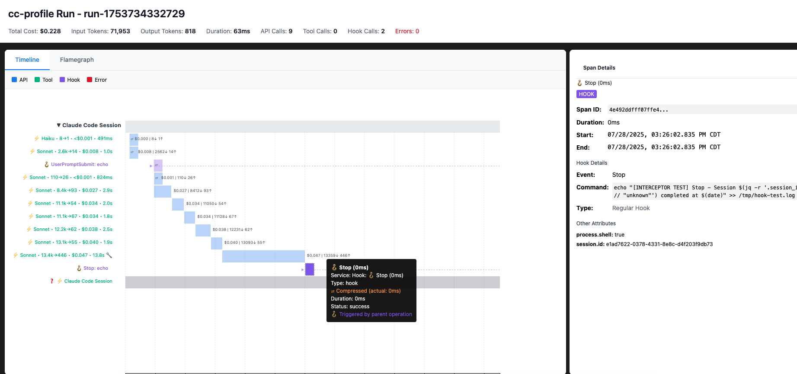

# cc-profile

Zero-Touch Tracing & Observability for Claude Code

cc-profile adds end-to-end, zero-config profiling of tool usage activity to Claude Code, outputted in OTEL format for consumption locally (simple HTML file) or into your observability platform of choice via an OTEL collector.

## Quick Start

```bash
# Install globally
npm install -g cc-profile

# One-time setup
cc-profile init

# Add shell alias (shown to end user with correct location after init)
claude() { ~/.cc-profile/bin/cc-profile-wrapper "$@"; }

# Use Claude normally - now with automatic tracing
claude
```

## Why cc-profile?

Claude Code users lack lightweight, always-on visibility into what actually happened during a run: prompts, tool calls, diffs, tests, latency, token costs. Existing tools attempt to capture some of this traffic but are missing hook-level signals and structured events. cc-profile provides dead-simple session inspection without standing up infrastructure - everything is generated using the tools already on the end user's machine (browser, Node.js)

Claude DOES export [some OTEL](https://docs.anthropic.com/en/docs/claude-code/monitoring-usage), but they do not give:

1. E2E api tracing including system prompts
2. Detailed tool call usage
3. Detailed hooks tracing with pass/failure modes.

They also force you to have a collector to see the data e.g. external OTEL service endpoint e.g. Datadog, Jaeger etc. This solution is entirely self contained and requires no extra dependencies beyond what every end user already has installed on their machine (A typescript runtime + a browser (html output))

## Features

**Complete Session Capture**

- API calls with request/response payloads, tokens, and costs
- All hook events (UserPromptSubmit, PreToolUse, PostToolUse, Stop, etc.)
- Tool executions with inputs and outputs
- File diffs and test results
- Timeline with latency metrics

**Self-Contained Reports**

- Single HTML file with embedded CSS/JS
- Interactive timeline and tool visualization
- Raw HTTP traffic viewer
- OpenTelemetry trace format
- No external dependencies or servers

**Zero-Touch Integration**

- Transparent Claude Code wrapper
- Automatic session logging
- Preserves normal Claude workflow
- Optional report auto-open

## Usage

### Normal Claude Usage (with tracing)

```bash
claude chat
claude --model sonnet-3.5 chat
claude --temperature 0.7 --help
```

### cc-profile Specific Options

```bash
# Open HTML report when session completes
claude --cc-open chat

# Disable tracing for this session
claude --cc-no-trace chat

# Show report path without opening
claude --cc-report chat
```


## Output

Logs are saved to: `~/.cc-profile/logs/<run_id>/`

- `events.jsonl` - OpenTelemetry trace data
- `report.html` - Self-contained HTML report



## Report Features

**Timeline View**

- Visual sequence of API calls and tool executions
- Latency and token usage metrics
- Expandable request/response details

**Tool Visualization**

- Structured display of tool inputs and outputs
- File diffs with syntax highlighting
- Test results and error details

**Raw Traffic**

- Complete HTTP request/response pairs
- Debug view with unfiltered API data
- Export capabilities

**Search & Filter**

- Filter by tool type, time range
- Search request/response content
- Model-specific views

## Under the Hood

cc-profile collects data primarily in two ways:

1. Instrumenting the API requests to claude via the interceptor pattern inspired by [claude-trace]
2. Instrumenting hooks by monkey patching the calls to subprocess via same interceptor pattern
3. Instrumenting tool calls with a hook (listens to PostToolUse and correlates with other metrics)

### Technical Implementation

**HTTP Interception**: Uses Node.js `--require` flag to monkey-patch `global.fetch` and `subprocess` before Claude Code starts. This captures all HTTP traffic and hooks spawned transparently without modifying Claude's source code.

**Hook System**: Deploys a universal orchestrator hook that registers for Claude Code events ( PostToolUse) and outputs OTEL compatible traces (OTLP)

**OTLP Export**: Custom OpenTelemetry exporter writes spans directly to JSONL files in standard OTLP format, enabling both local visualization and future platform integration.

**Self-Contained Reports**: HTML generator embeds trace data and JavaScript visualization directly into a single file, requiring no external assets or servers.

The result is a completely local, dependency-free solution that produces industry-standard traces ready for any observability ecosystem.

## Hook System

cc-profile captures all Claude Code hook events:

- **PreToolUse**: Before tool execution
- **PostToolUse**: After tool completion
- **UserPromptSubmit**: When user submits input
- **Notification**: Permission requests, idle warnings
- **Stop**: Main agent completion
- **SubagentStop**: Task tool completion
- **PreCompact**: Before conversation compression


## Development

### Local Development

```bash
git clone <repository>
cd cc-profile
npm install

# Install frontend dependencies
cd frontend && npm install && cd ..

# Build everything
npm run build

# Deploy to ~/.cc-profile for testing (use dev script for latest changes)
npm run dev:init

# Development mode with file watching
npm run dev
```

### Development Commands

```bash
# Development (always uses latest local build)
npm run dev:init                   # Initialize cc-profile with latest changes
npm run dev:run                    # Run cc-profile CLI with latest changes
npm run dev:html <file.jsonl>      # Generate HTML report with latest changes
npm run dev:token                  # Extract token with latest changes

# Production (uses global installation)
cc-profile init                    # Initialize cc-profile (global version)
cc-profile --generate-html         # Generate HTML report (global version)
```


### Build Process

```bash
npm run build          # Build backend + frontend
npm run build:backend  # TypeScript compilation
npm run build:frontend # Web interface bundling
npm run clean          # Remove build artifacts
```

### Testing

```bash
# Test CLI compilation
npm run typecheck

# Test package creation
npm pack --dry-run

# Test global installation
npm install -g ./cc-profile-*.tgz
cc-profile --help
```

## Configuration

### Basic Configuration

Most users need no configuration beyond the initial setup. The wrapper handles everything automatically.

### Advanced Configuration

**Request Filtering**: By default, only substantial conversations (>2 messages) are logged. Use `--include-all-requests` to capture everything.

**Custom Hooks**: Add project-specific hooks in `~/.claude/managed-hooks.settings.json` or `./.claude/managed-hooks.settings.json`.

**Environment Variables**:

- `CC_PROFILE_OPEN_HTML`: Auto-open reports (true/false)
- `CC_PROFILE_REPORT_ONLY`: Show report path without opening

## License

MIT License - see LICENSE file

## Contributing

1. Fork the repository
2. Create a feature branch
3. Make changes and add tests
4. Run `npm run build` and `cc-profile init` to test
5. Submit a pull request
